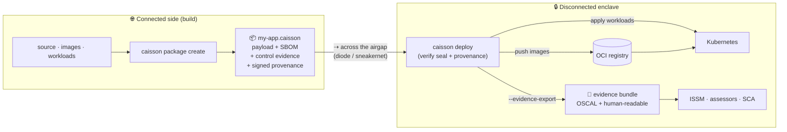

<p align="center">
  
</p>

<h1 align="center">Caisson</h1>

<p align="center"><em>Compliance-native airgap delivery.</em></p>

<p align="center">
  <strong>Nothing crosses the gap unsealed.</strong><br/>
  Sealed at the source. Evidence on arrival.
</p>

<p align="center">
  <code>caisson package create ./my-app</code> &nbsp;→&nbsp; <code>caisson deploy my-app.caisson --evidence-export</code>
</p>

---

> **Status: scaffold.** Every command runs and prints realistic placeholder output.
> The package format, compliance evidence, and deploy logic live behind stable
> interfaces (`internal/pkgformat`, `internal/evidence`, `internal/deploy`) ready
> for real implementation.

## Vision

Getting software into an airgapped environment is a solved-ish problem. Getting it in
*with proof* is not.

Today, teams shipping into disconnected DoD and critical-infrastructure enclaves move the
artifact one way and the compliance story another: the SBOM lives in a pipeline log, the
NIST 800-53 / CMMC control mappings live in a binder, the provenance lives in someone's
memory — and all three drift apart the moment the artifact leaves the connected side. Six
months later an assessor asks "what's actually running behind the gap, and prove it," and
the answer is a scramble.

**Caisson makes the package carry its own evidence.** A Caisson vault seals an application
together with its signed SBOM, its mapped control evidence, and its cryptographic
provenance into a single portable artifact. What lands in the disconnected environment
arrives sealed, signed, and **assessment-ready** — the evidence is a first-class part of
the payload, not a parallel paper trail.

Target users: **DoD programs, defense contractors, and regulated critical infrastructure.**

### What Caisson is *not*

Caisson is **complementary to existing airgap tooling, not a replacement for it.** It does
not reinvent airgap transfer, OCI registries, or Kubernetes — it wraps the registries and
clusters you already run and adds the compliance layer on top. If you already move bits
across the gap with tooling you trust, Caisson rides alongside it and makes the evidence
travel sealed with the payload.

## Quickstart

```bash
# build
go build -o caisson .

# 0. (optional) generate a signing keypair
./caisson key gen --out caisson
#   private → caisson.key   public → caisson.pub

# 1. SEAL a directory into a real .caisson vault (writes a file to disk).
#    With --key, the vault is Ed25519-signed and gets a SLSA provenance attestation.
./caisson package create ./examples/hello-app --version 1.0.0 --key caisson.key
#   ✓ packed 5 files · content digest computed
#   ✓ signed (ed25519) · SLSA provenance attested
#   vault → hello-app.caisson

# 1b. VERIFY the seal, signature, and provenance (pin the trusted key)
./caisson verify hello-app.caisson --key caisson.pub
#   ✓ seal ✓ signature ✓ identity ✓ provenance

# 2. INSPECT what a sealed vault carries (read-only)
./caisson package inspect hello-app.caisson

# 3. read the sealed file inventory
./caisson sbom view hello-app.caisson

# 4. DEPLOY — verifies the payload digest against the sealed manifest first.
#    A tampered vault is refused (non-zero exit); registry push + k8s apply
#    are described but not yet executed.
./caisson deploy hello-app.caisson --evidence-export

# 5. export a real evidence bundle to disk, derived from the vault's actual
#    digest + inventory (JSON + OSCAL-aligned + Markdown report)
./caisson evidence export hello-app.caisson --out ./evidence
#   → ./evidence/hello-app/{evidence.json, oscal-assessment-results.json, evidence.md}

# run caisson with no arguments for the map (and one honest promise)
./caisson
```

> `caisson deploy` is the convenience form of `caisson package deploy` — both do the same thing.

**What's real vs. scaffold today.** Real work: `package create` writes a standard gzip+tar
`.caisson` (open it with `tar -tzf`) with a per-file SHA-256 inventory and content digest,
and — with `--key` — an **Ed25519 signature** over the manifest plus a **DSSE-wrapped SLSA
provenance attestation**; `package inspect` and `sbom view` read it back; `verify` and
`deploy` check the seal, signature, identity, and provenance and **refuse a tampered or
badly-signed vault** (non-zero exit); and `evidence export` writes a real bundle to disk
(native JSON, an OSCAL-aligned assessment-results file, and a Markdown report) whose control
mapping reflects the artifact's actual state — e.g. `SR-11` flips to *satisfied* once the
vault is signed. Still placeholder (clearly marked in output): Sigstore/cosign keyless
interop, a full dependency SBOM (Syft), vulnerability scans feeding `RA-5`, schema-validated
OSCAL, and the actual registry push / Kubernetes apply.

### Test it locally

Requires **Go 1.22+** (for the CLI) and **Python 3** (only to serve the static site).

```bash
make build     # build the ./caisson binary
make run        # build + run with no args (prints the vault banner)
make demo       # run every stub command end-to-end
make site       # serve the landing page at http://localhost:8000
make help       # list all targets
```

No Makefile? The equivalents are `go build -o caisson .`, `./caisson`, and
`cd web && python3 -m http.server` (then open <http://localhost:8000>).
Everything prints placeholder output today — nothing touches a real registry, cluster,
or filesystem yet.

## Architecture

Caisson has two halves: **seal on the connected side, verify-and-apply on the disconnected
side.** In between, the vault crosses the airgap however you already move bits (data diode,
sneakernet, one-way transfer). The compliance evidence rides *inside* the vault the whole way.



If Mermaid doesn't render, the flow is: **source → `package create` → sealed `.caisson`
vault (payload + SBOM + evidence + provenance) → across the airgap → `deploy` verifies the
seal → pushes images to your OCI registry, applies workloads to Kubernetes, and exports the
evidence bundle for assessors.**

### How it interoperates (rather than reinventing)

| Layer | Caisson provides | Caisson reuses (does not reinvent) |
|---|---|---|
| Transfer across the gap | a self-describing sealed artifact to move | your existing one-way transfer / diode / sneakernet |
| Image distribution | seal verification + push orchestration | **OCI registries** on the disconnected side |
| Workload delivery | manifest capture + apply on arrival | **Kubernetes** in the enclave |
| Supply chain | signed SBOM sealed into the vault | SPDX / CycloneDX, cosign, SLSA provenance |
| Compliance | control mappings + assessment bundle export | NIST 800-53, CMMC, OSCAL |

The internal packages mirror this split, so real implementation drops into stable seams:

```
caisson/
├── main.go                     # entrypoint
├── cmd/                        # cobra commands (thin; render only)
│   ├── root.go  init.go  package.go  deploy.go  sbom.go  evidence.go
└── internal/
    ├── pkgformat/              # the .caisson vault format: pack, inspect, seal, SBOM
    ├── evidence/               # NIST 800-53 / CMMC control mapping + bundle export
    ├── deploy/                 # verify seal → OCI registry push → k8s apply → evidence
    └── brand/                  # shared identity strings + terminal banner
```

## Meet Caisson


Caisson is our mascot — an armored combat-engineer guardian who carries a sealed hexagonal
vault on his back across denied territory. He learned two trades nobody else would take:
sinking foundations under crushing pressure where ordinary builders buckle, and hauling
live payloads across ground where the road home is already cut. He never asks what's inside
the vault. He only guarantees it lands **sealed, signed, and standing**.

> **"Nothing crosses the gap unsealed."**

The full character sheet, palette, and art live in [`brand/`](brand/).

---

<p align="center">
  A <a href="https://gooptimal.io">GoOptimal</a> project by Optimal&nbsp;Labs.<br/>
  <sub>Caisson is complementary to existing airgap tooling — not a replacement for it.</sub>
</p>
