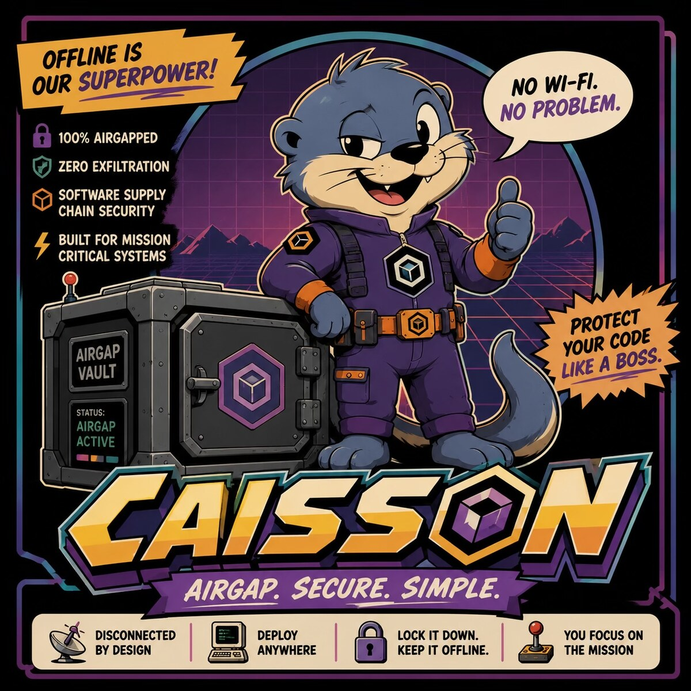
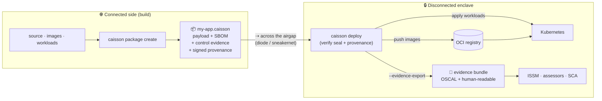

<p align="center">
  
</p>

<h1 align="center">Caisson</h1>

<p align="center"><em>Compliance-native airgap delivery.</em></p>

<p align="center">
  <strong>Nothing crosses the gap unsealed.</strong><br/>
  Sealed at the source. Evidence on arrival.
</p>

<p align="center">
  <code>caisson package create ./my-app</code> &nbsp;→&nbsp; <code>caisson deploy my-app.caisson --evidence-export</code>
</p>

---

> **Status: scaffold.** Every command runs and prints realistic placeholder output.
> The package format, compliance evidence, and deploy logic live behind stable
> interfaces (`internal/pkgformat`, `internal/evidence`, `internal/deploy`) ready
> for real implementation.

## Vision

Getting software into an airgapped environment is a solved-ish problem. Getting it in
*with proof* is not.

Today, teams shipping into disconnected DoD and critical-infrastructure enclaves move the
artifact one way and the compliance story another: the SBOM lives in a pipeline log, the
NIST 800-53 / CMMC control mappings live in a binder, the provenance lives in someone's
memory — and all three drift apart the moment the artifact leaves the connected side. Six
months later an assessor asks "what's actually running behind the gap, and prove it," and
the answer is a scramble.

**Caisson makes the package carry its own evidence.** A Caisson vault seals an application
together with its signed SBOM, its mapped control evidence, and its cryptographic
provenance into a single portable artifact. What lands in the disconnected environment
arrives sealed, signed, and **assessment-ready** — the evidence is a first-class part of
the payload, not a parallel paper trail.

Target users: **DoD programs, defense contractors, and regulated critical infrastructure.**

### What Caisson is *not*

Caisson is **complementary to existing airgap tooling, not a replacement for it.** It does
not reinvent airgap transfer, OCI registries, or Kubernetes — it wraps the registries and
clusters you already run and adds the compliance layer on top. If you already move bits
across the gap with tooling you trust, Caisson rides alongside it and makes the evidence
travel sealed with the payload.

## Quickstart

> **Deploying for real?** See **[DEPLOYING.md](DEPLOYING.md)** — the concise seal → carry →
> deploy guide with real sample output and the policy-gate flags.

```bash
# build
go build -o caisson .

# 0. (optional) generate a signing keypair
./caisson key gen --out caisson
#   private → caisson.key   public → caisson.pub

# 0b. (optional) scaffold a caisson.yaml — the declarative package definition
#     (name, version, source, images, k8s manifests, frameworks, signing key).
#     package create reads it when present; flags override individual fields.
./caisson init --name hello-app
#   → writes ./caisson.yaml   (edit to taste, then `caisson package create`)

# 1. SEAL a directory into a real .caisson vault (writes a file to disk).
#    With --key, the vault is Ed25519-signed and gets a SLSA provenance attestation.
#    examples/hello-app ships a caisson.yaml, so name/version/images/frameworks
#    come from it — flags (like --key here) still override.
./caisson package create ./examples/hello-app --key caisson.key
#   ✓ read examples/hello-app/caisson.yaml
#   ✓ packed 7 files · content digest computed
#   ✓ frameworks mapped: NIST SP 800-53 Rev 5, CMMC 2.0 Level 2
#   ✓ signed (ed25519) · SLSA provenance attested
#   vault → hello-app.caisson

# 1b. VERIFY the seal, signature, and provenance (pin the trusted key)
./caisson verify hello-app.caisson --key caisson.pub
#   ✓ seal ✓ signature ✓ identity ✓ provenance

# 2. INSPECT what a sealed vault carries (read-only)
./caisson package inspect hello-app.caisson

# 3. read the sealed CycloneDX SBOM (deps detected from the payload) or export it
./caisson sbom view hello-app.caisson
./caisson sbom export hello-app.caisson --out ./evidence   # → ./evidence/hello-app.cdx.json

# 3b. (optional) embed a vulnerability scan you produced (grype/trivy JSON):
#     ./caisson package create ./examples/hello-app --key caisson.key \
#         --scan-report examples/hello-app-scan.grype.json

# 3c. (optional, needs a reachable registry) pull the declared images into an
#     OCI layout sealed inside the vault; the seal + verify then cover the images
#     too (content-addressed). Without --pull-images, images are recorded as
#     declared-only.
#     ./caisson package create ./examples/hello-app --key caisson.key --pull-images

# 4. DEPLOY — verifies seal + signature, then enforces a policy gate. A tampered,
#    badly-signed, or policy-violating vault is refused (non-zero exit). Without
#    --apply this prints the delivery plan (dry run).
./caisson deploy hello-app.caisson --require-signature --deny-severity critical --evidence-export

# 4b. (needs a reachable registry + cluster) actually deliver: push the sealed
#     images to the registry (go-containerregistry) and apply the workloads with
#     kubectl. The seal/signature/policy checks still run first and gate it.
#     ./caisson deploy hello-app.caisson --require-signature --apply \
#         --registry reg.enclave:5000 --namespace prod

# 5. export a real evidence bundle to disk, derived from the vault's actual
#    digest + inventory (JSON + schema-validated OSCAL + Markdown report)
./caisson evidence export hello-app.caisson --out ./evidence
#   → ./evidence/hello-app/{evidence.json, oscal-assessment-results.json, evidence.md}

# run caisson with no arguments for the map (and one honest promise)
./caisson
```

> `caisson deploy` is the convenience form of `caisson package deploy` — both do the same thing.

**What's real vs. scaffold today.** Real work: `caisson init` writes a real `caisson.yaml`
(name, version, source, images, k8s manifests, frameworks, signing key) and `package create`
reads it when present, with flags overriding individual fields; `package create` writes a
standard gzip+tar
`.caisson` (open it with `tar -tzf`) with a per-file SHA-256 inventory and content digest, an
embedded **CycloneDX SBOM** (native detection from go.mod / package.json /
requirements.txt / Dockerfile, or `--syft` to wrap **Anchore Syft** for deep resolution —
transitive deps, OS packages, licenses), and — with `--key` — an **Ed25519 signature** plus
**DSSE-wrapped SLSA provenance and CycloneDX SBOM attestations**; `package inspect`,
`sbom view`, and `sbom export` read them back; `verify` and `deploy` check the seal,
signature, identity, provenance, and SBOM/vuln attestations and **refuse a tampered,
badly-signed, or policy-violating vault** (non-zero exit); `package create --scan-report`
ingests a Grype/Trivy scan, seals it, and DSSE-attests it, and `deploy --deny-severity` /
`--require-signature` enforce a policy gate; `package create --pull-images` fetches the
declared container images into an **OCI image layout sealed inside the vault** (via
go-containerregistry), records each image's content digest in the signed manifest, and
`verify`/`deploy` re-check that layout so a tampered image is refused — real image pulls need
registry access, but the layout writing + verification are content-addressed and unit-tested
offline; and `evidence export` writes a real bundle to
disk (native JSON, an OSCAL-aligned assessment-results file, and a Markdown report) whose
control mapping reflects the artifact's actual state — e.g. `SR-11` flips to *satisfied* once
signed, `CM-8`/`SA-12` cite the real SBOM component count, and `RA-5` flips to *satisfied*
once a scan is attached, and the OSCAL assessment-results file is **validated against NIST's
published OSCAL 1.1.2 schema** (bundled, offline) before it's written; and `deploy --apply`
performs the real delivery — pushing the sealed images to the target registry
(go-containerregistry) and applying the workloads with `kubectl` — behind the seal, signature,
and policy gate, needing a reachable registry and cluster with credentials (without `--apply` it
prints the plan). Still placeholder (clearly marked in output): Sigstore/cosign keyless interop,
running a scanner (bring your own report), and Helm-based applies.

### Test it locally

Requires **Go 1.22+** (for the CLI) and **Python 3** (only to serve the static site).

```bash
make build     # build the ./caisson binary
make run        # build + run with no args (prints the vault banner)
make demo       # run every stub command end-to-end
make site       # serve the landing page at http://localhost:8000
make help       # list all targets
```

No Makefile? The equivalents are `go build -o caisson .`, `./caisson`, and
`cd web && python3 -m http.server` (then open <http://localhost:8000>).
Everything prints placeholder output today — nothing touches a real registry, cluster,
or filesystem yet.

## Architecture

Caisson has two halves: **seal on the connected side, verify-and-apply on the disconnected
side.** In between, the vault crosses the airgap however you already move bits (data diode,
sneakernet, one-way transfer). The compliance evidence rides *inside* the vault the whole way.



If Mermaid doesn't render, the flow is: **source → `package create` → sealed `.caisson`
vault (payload + SBOM + evidence + provenance) → across the airgap → `deploy` verifies the
seal → pushes images to your OCI registry, applies workloads to Kubernetes, and exports the
evidence bundle for assessors.**

### How it interoperates (rather than reinventing)

| Layer | Caisson provides | Caisson reuses (does not reinvent) |
|---|---|---|
| Transfer across the gap | a self-describing sealed artifact to move | your existing one-way transfer / diode / sneakernet |
| Image distribution | seal verification + push orchestration | **OCI registries** on the disconnected side |
| Workload delivery | manifest capture + apply on arrival | **Kubernetes** in the enclave |
| Supply chain | signed SBOM sealed into the vault | SPDX / CycloneDX, cosign, SLSA provenance |
| Compliance | control mappings + assessment bundle export | NIST 800-53, CMMC, OSCAL |

The internal packages mirror this split, so real implementation drops into stable seams:

```
caisson/
├── main.go                     # entrypoint
├── cmd/                        # cobra commands (thin; render only)
│   ├── root.go  init.go  package.go  deploy.go  sbom.go  evidence.go
└── internal/
    ├── spec/                   # caisson.yaml: parse the package definition + scaffold init
    ├── pkgformat/              # the .caisson vault format: pack, inspect, seal, SBOM
    ├── oci/                    # pull images into a sealed OCI layout; verify it (content-addressed)
    ├── evidence/               # NIST 800-53 / CMMC control mapping + bundle export
    ├── deploy/                 # verify seal → OCI registry push → k8s apply → evidence
    └── brand/                  # shared identity strings + terminal banner
```

## Meet Caisson

Caisson is our mascot — a scrappy, airgap-proud otter who hauls your sealed payload into the
disconnected dark and makes sure it lands **sealed, signed, and standing**. Offline is his
superpower: no Wi-Fi, no problem. He never asks what's inside the vault — he only guarantees
that nothing crosses the gap unsealed.

> **"Nothing crosses the gap unsealed."**

Brand marks, mascot art, and the palette live in [`brand/`](brand/) — see [`BRAND-KIT.md`](brand/BRAND-KIT.md).

---

<p align="center">
  A <a href="https://gooptimal.io">GoOptimal</a> project by Optimal&nbsp;Labs.<br/>
  <sub>Caisson is complementary to existing airgap tooling — not a replacement for it.</sub>
</p>
